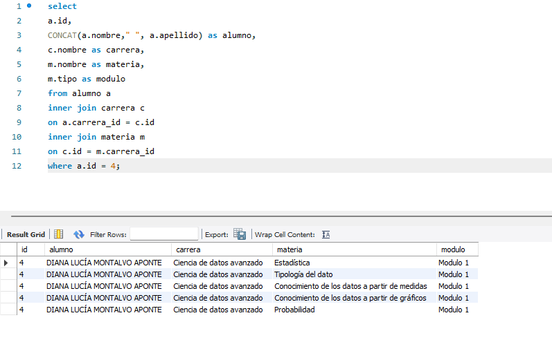

# POO Persistencia en Java
Practica Programacion Orientado a Objetos usando persistencia con el ORM JPA y como proveedor eclipseLink en JAVA, creando un CRUD utilizando una base de datos MySQL

## Diagrama DER

## Codigo BB

## Consulta de alumno

## Consola
